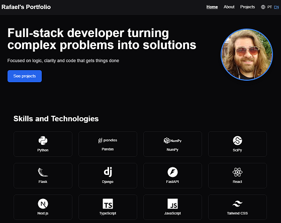

<p align="right">
  🇧🇷 <a href="#em-português">Versão em português</a> •
  🇺🇸 <a href="#in-english">English version</a>
</p>

---

## 🇧🇷 Em português

# 🌐 Portfólio do Rafael

Esse é o código-fonte do meu portfólio pessoal: um espaço onde apresento meus projetos, minha trajetória como dev e um pouco da minha forma de pensar e trabalhar.

A ideia aqui é mostrar, de forma direta e visual, como aplico meus conhecimentos em front e back-end — com foco em clareza, organização e boas práticas.

> 🔗 Acesse o site: [portfolio-rafaelsouza.netlify.app](https://portfolio-rafaelsouza.netlify.app/)

---

## 🛠️ Tecnologias e ferramentas

- [Next.js 15 (App Router)](https://nextjs.org/)
- [TypeScript](https://www.typescriptlang.org/)
- [Tailwind CSS](https://tailwindcss.com/)
- [next-intl](https://next-intl-docs.vercel.app/) (para i18n)
- [React Icons](https://react-icons.github.io/react-icons/)
- Deploy via [Netlify](https://www.netlify.com/)

---

## ⚙️ Como rodar localmente

```bash
git clone https://github.com/rafaeljsouza/portfolio
cd portfolio
npm install
npm run dev
```

O projeto roda em `http://localhost:3000`

---

## ✨ Funcionalidades

- 🌍 Alternância entre português e inglês
- 🧠 Apresentação pessoal realista e sem clichê dev
- 💡 Projetos com foco em propósito e resolução de problemas
- 📱 Layout responsivo (mobile first)
- 💬 Internacionalização com cookie + fallback
- 🔒 Deploy seguro e limpo via Netlify

## 🗂 Estrutura

```
src/      # Componentes e páginas Next.js
messages/ # Textos traduzidos
public/   # Imagens e arquivos estáticos
```

---

## 📸 Prévia

> *(Adicione uma imagem chamada `screenshot.png` na raiz do projeto para usar abaixo)*

```md

```

---

## 🤝 Licença

Este projeto é open-source e livre para aprendizado, uso pessoal e como base para outros portfólios.

---

Se quiser trocar ideias, contribuir ou bater um papo sobre código:  
📬 [LinkedIn](https://www.linkedin.com/in/rafaeljsouza/) | [Portfólio](https://portfolio-rafaelsouza.netlify.app/)

---

## 🇺🇸 In English

# 🌐 Rafael's Portfolio

This is the source code of my personal portfolio — a space to showcase my projects, development journey, and how I think and work as a dev.

The idea here is to present my skills in frontend and backend in a clean, direct, and practical way — focusing on clarity, organization, and good practices.

> 🔗 Live site: [portfolio-rafaelsouza.netlify.app](https://portfolio-rafaelsouza.netlify.app/)

---

## 🛠️ Technologies and tools

- [Next.js 15 (App Router)](https://nextjs.org/)
- [TypeScript](https://www.typescriptlang.org/)
- [Tailwind CSS](https://tailwindcss.com/)
- [next-intl](https://next-intl-docs.vercel.app/) (for i18n)
- [React Icons](https://react-icons.github.io/react-icons/)
- Deployed with [Netlify](https://www.netlify.com/)

---

## ⚙️ How to run locally

```bash
git clone https://github.com/rafaeljsouza/portfolio
cd portfolio
npm install
npm run dev
```

App runs on `http://localhost:3000`

---

## ✨ Features

- 🌍 Language switcher (PT/EN)
- 🧠 No "passionate about code" clichés — just real dev work
- 💡 Projects with purpose and problem-solving focus
- 📱 Fully responsive layout (mobile first)
- 💬 Cookie-based i18n with fallback
- 🔒 Clean and secure deployment via Netlify

## 🗂 Project structure

```
src/      # Next.js components and pages
messages/ # Translated text files
public/   # Static images and assets
```

---

## 📸 Preview

> *(Place a `screenshot.png` in the root to use this)*

```md

```

---

## 🤝 License

This project is open-source and free to use for learning, personal use, or as inspiration for your own portfolio.

---

Want to connect, contribute or chat about code?  
📬 [LinkedIn](https://www.linkedin.com/in/rafaeljsouza/) | [Portfolio](https://portfolio-rafaelsouza.netlify.app/)
